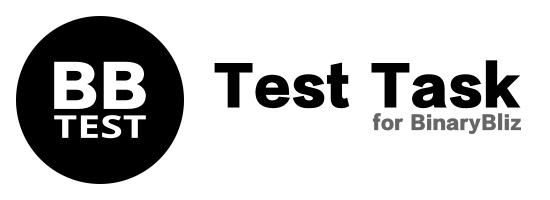

----------------------------------------------

### Used technologies and libs
**Kotlin** - main programming language\
**Dagger 2** - DI framework\
**Moxy** - MVP library\
**Retrofit2** and **OkHttp3** - for HTTP requests to API\
**Glide** - for image loading\
**Kotlin Coroutines** - for async work with HTTP\
**JUnit4**, **Mockito** and **Spek** - for unit testing
